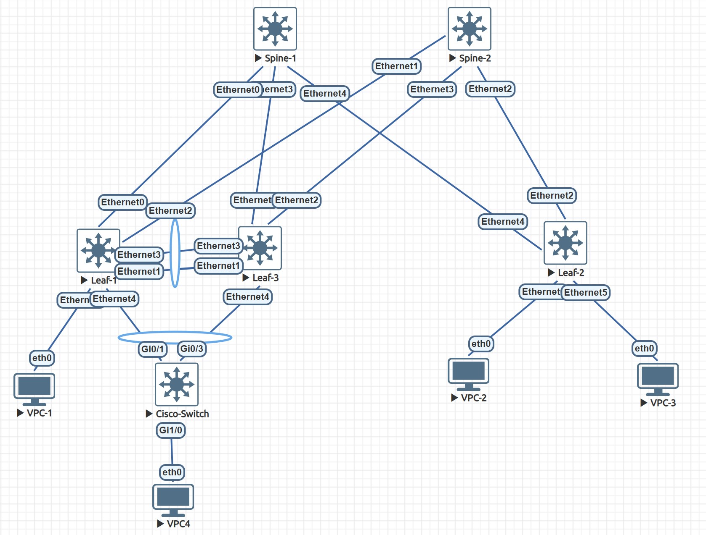

# Learning Software for Open Networking in the Cloud (SONiC) 
https://sonicfoundation.dev/

## Images
* Download: https://sonic.software/
* Broadcom virtual switch: version 3.1.2
* Account: admin/YourPaSsWoRd
* Interface: format with file sonicsw.yml
```bash
cp ./EVE-NG/sonicsw-broadcom.yml /opt/unetlab/html/templates/intel/sonicsw.yml
```

## Maintainance Mode
We have 3 options to maintain network services without affect to traffic loading.
* <b>Docker container maintainance</b>
    * Maintain each container without affect to others. Like VRRP container, DHCP container.
* <b>Network OS maintainance</b>
    * Maintain whole OS running on device - Control Plane. But it still don't affect to Data Plane.
* <b>Maintainance mode</b>
    * Graceful isolation of Swich on forwarding path.
    * Maintainance on switch without affect to user traffic.

## Basic configuration
**Disable ZTP**
```bash
sudo ztp disable -y
```
**Check system, services, containers**
```bash
show system status
System is ready
```
**Configuration mode**
```bash
sonic-cli
```

## Topology


## BGP Underlay
```bash
Spine-2# show bgp ipv4 unicast summary
BGP router identifier 192.168.0.2, local AS number 65000
Neighbor    V   AS      MsgRcvd   MsgSent   InQ     OutQ    Up/Down         State/PfxRcd
1.1.1.0     4   65101   8         11        0       0       00:00:27        2
1.1.1.3     4   65102   8         11        0       0       00:00:25        2
Total number of neighbors 2
Total number of neighbors established 2

Leaf-2# show ip route
Codes:  K - kernel route, C - connected, S - static, B - BGP, O - OSPF
        > - selected route, * - FIB route, q - queued route, r - rejected route, # - not installed in hardware
       Destination                  Gateway                                                Dist/Metric   Uptime
-------------------------------------------------------------------------------------------------------------------
 B>*   1.1.1.0/31                   via 1.1.1.2                   Ethernet4                20/0          00:01:47
 C>*   1.1.1.2/31                   Direct                        Ethernet4                0/0           00:26:05
 B>*   192.168.0.1/32               via 1.1.1.2                   Ethernet4                20/0          00:01:47
 B>*   192.168.0.2/32               via 1.1.1.2                   Ethernet4                20/0          00:01:47
 C>*   192.168.0.3/32               Direct                        Loopback0                0/0           00:26:15

Leaf-2# ping 192.168.0.1
PING 192.168.0.1 (192.168.0.1) 56(84) bytes of data.
64 bytes from 192.168.0.1: icmp_seq=1 ttl=63 time=12.9 ms
64 bytes from 192.168.0.1: icmp_seq=2 ttl=63 time=20.9 ms
64 bytes from 192.168.0.1: icmp_seq=3 ttl=63 time=7.81 ms
64 bytes from 192.168.0.1: icmp_seq=4 ttl=63 time=12.5 ms
64 bytes from 192.168.0.1: icmp_seq=5 ttl=63 time=6.49 ms
```

## VXLAN BGP EVPN
**Verify VXLAN**
```bash
Leaf-2# show Vlan
Q: A - Access (Untagged), T - Tagged
NUM        Status      Q Ports
10         Active      A  Ethernet0
11         Active      A  Ethernet5
2000       Active

Leaf-2# show vxlan interface
VTEP Name        :  vtep1
VTEP Source IP   :  100.1.1.1
EVPN NVO Name    :  nvo1
EVPN VTEP        :  vtep1
Source Interface :  Loopback1

Leaf-2# show vxlan vlanvnimap
VLAN      VNI
======    =====
Vlan10    10010
Vlan11    10011
Vlan2000  200000
Total count :    3

Leaf-2# show vxlan vrfvnimap
VRF       VNI
======    =====
Vrf1      200000
Total count :    1
```

**Verify BGP EVPN**
```bash
Spine-2# show bgp l2vpn evpn summary
BGP router identifier 192.168.0.2, local AS number 65000
Neighbor    V   AS      MsgRcvd   MsgSent   InQ     OutQ    Up/Down         State/PfxRcd
1.1.1.0     4   65101   69        76        0       0       00:04:59        0
1.1.1.3     4   65102   61        66        0       0       00:01:00        0
Total number of neighbors 2
Total number of neighbors established 2

Leaf-1# show bgp l2vpn evpn route
BGP table version is 3, local router ID is 192.168.1.1
Status codes: s suppressed, d damped, h history, * valid, > best, i - internal
Origin codes: i - IGP, e - EGP, ? - incomplete
EVPN type-1 prefix: [1]:[ESI]:[EthTag]
EVPN type-2 prefix: [2]:[EthTag]:[MAClen]:[MAC]:[IPlen]:[IP]
EVPN type-3 prefix: [3]:[EthTag]:[IPlen]:[OrigIP]
EVPN type-4 prefix: [4]:[ESI]:[IPlen]:[OrigIP]
EVPN type-5 prefix: [5]:[EthTag]:[IPlen]:[IP]
   Network          Next Hop            Metric LocPrf Weight Path
                    Extended Community
Route Distinguisher: 192.168.0.1:5096
*>   [5]:[0]:[24]:[10.1.1.0]
                    100.1.1.1                0                 32768 ?
                    ET:8 RT:65101:200000 Rmac:50:00:00:03:00:00
Route Distinguisher: 192.168.0.3:5096
*>   [5]:[0]:[24]:[10.1.1.0]
                    100.2.2.2                                      0 65000 65102 ?
                    RT:65102:200000 ET:8 Rmac:50:00:00:01:00:00
*>   [5]:[0]:[24]:[11.1.1.0]
                    100.2.2.2                                      0 65000 65102 ?
                    RT:65102:200000 ET:8 Rmac:50:00:00:01:00:00
Route Distinguisher: 192.168.1.1:10
*>   [2]:[0]:[48]:[00:50:79:66:68:02]
                    100.1.1.1                                  32768 i
                    ET:8 RT:65101:10010
*>   [2]:[0]:[48]:[00:50:79:66:68:02]:[32]:[10.1.1.1]
                    100.1.1.1                                  32768 i
                    ET:8 RT:65101:10010 RT:65101:200000 Rmac:50:00:00:03:00:00
*>   [3]:[0]:[32]:[100.1.1.1]
                    100.1.1.1                                  32768 i
                    ET:8 RT:65101:10010
Route Distinguisher: 192.168.1.3:10
*>   [2]:[0]:[48]:[00:50:79:66:68:05]
                    100.2.2.2                                      0 65000 65102 i
                    RT:65102:10010 ET:8
*>   [2]:[0]:[48]:[00:50:79:66:68:05]:[32]:[10.1.1.2]
                    100.2.2.2                                      0 65000 65102 i
                    RT:65102:10010 RT:65102:200000 ET:8 Rmac:50:00:00:01:00:00
*>   [3]:[0]:[32]:[100.2.2.2]
                    100.2.2.2                                      0 65000 65102 i
                    RT:65102:10010 ET:8
Route Distinguisher: 192.168.1.3:11
*>   [2]:[0]:[48]:[00:50:79:66:68:06]
                    100.2.2.2                                      0 65000 65102 i
                    RT:65102:10011 ET:8
*>   [2]:[0]:[48]:[00:50:79:66:68:06]:[32]:[11.1.1.2]
                    100.2.2.2                                      0 65000 65102 i
                    RT:65102:10011 RT:65102:200000 ET:8 Rmac:50:00:00:01:00:00
*>   [3]:[0]:[32]:[100.2.2.2]
                    100.2.2.2                                      0 65000 65102 i
                    RT:65102:10011 ET:8
Displayed 12 prefixes (12 paths)

# Specify evpn route type
Leaf-1# show bgp l2vpn evpn route type
  ead        Ethernet Auto-Discovery (type-1) route
  es         Ethernet Segment (type-4) route
  macip      MAC-IP (type-2) route
  multicast  Multicast (type-3) route
  prefix     Prefix (type-5) route

Leaf-1# show ip route vrf Vrf1
Codes:  K - kernel route, C - connected, S - static, B - BGP, O - OSPF
        > - selected route, * - FIB route, q - queued route, r - rejected route, # - not installed in hardware
       Destination                  Gateway                                                Dist/Metric   Uptime
-------------------------------------------------------------------------------------------------------------------
 C>*   10.1.1.0/24                  Direct                        Vlan10                   0/0           00:39:07
 B>*   10.1.1.2/32                  via 100.2.2.2                 Vlan2000                 20/0          00:21:19
 B>*   11.1.1.0/24                  via 100.2.2.2                 Vlan2000                 20/0          00:26:44
 B>*   11.1.1.2/32                  via 100.2.2.2                 Vlan2000                 20/0          00:26:20
```

**Ping gateway from PC to enable Auto-Discovery**
```bash
VPCS> ping 10.1.1.254
84 bytes from 10.1.1.254 icmp_seq=1 ttl=64 time=4.368 ms
84 bytes from 10.1.1.254 icmp_seq=2 ttl=64 time=1.878 ms
84 bytes from 10.1.1.254 icmp_seq=3 ttl=64 time=2.686 ms
84 bytes from 10.1.1.254 icmp_seq=4 ttl=64 time=3.405 ms
84 bytes from 10.1.1.254 icmp_seq=5 ttl=64 time=2.343 ms

VPCS> show arp
00:00:22:22:22:22  10.1.1.254 expires in 96 seconds

# Recheck VXLAN tunnel
Leaf-1# show vxlan tunnel
Name                SIP               DIP                 source      operstatus
=======             ======            ======              ======      ========
EVPN_100.2.2.2      100.1.1.1         100.2.2.2           EVPN        oper_up

# Ping to remote sites
VPCS> ping 11.1.1.2
84 bytes from 11.1.1.2 icmp_seq=1 ttl=62 time=22.746 ms
84 bytes from 11.1.1.2 icmp_seq=2 ttl=62 time=38.375 ms
84 bytes from 11.1.1.2 icmp_seq=3 ttl=62 time=17.787 ms

VPCS> ping 10.1.1.2
84 bytes from 10.1.1.2 icmp_seq=1 ttl=64 time=16.756 ms
84 bytes from 10.1.1.2 icmp_seq=2 ttl=64 time=8.156 ms
84 bytes from 10.1.1.2 icmp_seq=3 ttl=64 time=16.087 ms
```


## OSPF 
Choose point-to-point network type:
* <b>No DR/BDR election</b>, reducing sending multicast message.
* <b>Minimize LSDB and faster network convergence</b>, only exchange LSA Type 1, no Type 2.

**OSPF neighbors**
```bash
# No DR/BDR election.
Spine-1# show ip ospf neighbor

Neighbor ID     Pri State           Dead Time Address         Interface            RXmtL RqstL DBsmL
192.168.0.1       1 Full/DROther      38.167s 192.168.0.1     Ethernet0:192.168.0.2     0     0     0
192.168.0.3       1 Full/DROther      36.483s 192.168.0.3     Ethernet4:192.168.0.2     0     0     0
```

**OSPF LSDB**
```bash
# Only LSA Type 1, no LSA Type 2.
Spine-1# show ip ospf database
VRF Name: default

       OSPF Router with ID (192.168.0.2)

                Router Link States (Area 0.0.0.1)

Link ID         ADV Router      Age  Seq#       CkSum  Link count
192.168.0.1     192.168.0.1       20 0x80000006 0xd43b 2
192.168.0.2     192.168.0.2       48 0x8000000a 0x8b6c 3
192.168.0.3     192.168.0.3      111 0x80000004 0x715d 2
```

**OSPF routes**
```bash
Spine-1# show ip ospf route
============ OSPF network routing table ============
N    192.168.0.1/32        [65635] area: 0.0.0.1
                           via 192.168.0.1, Ethernet0
N    192.168.0.2/32        [100] area: 0.0.0.1
                           directly attached to Loopback0
N    192.168.0.3/32        [65635] area: 0.0.0.1
                           via 192.168.0.3, Ethernet4

============ OSPF router routing table =============

============ OSPF external routing table ===========
```

**Verify**
```bash
Leaf-1# ping 192.168.0.3
PING 192.168.0.3 (192.168.0.3) 56(84) bytes of data.
64 bytes from 192.168.0.3: icmp_seq=1 ttl=63 time=11.2 ms
64 bytes from 192.168.0.3: icmp_seq=2 ttl=63 time=7.70 ms
64 bytes from 192.168.0.3: icmp_seq=3 ttl=63 time=5.29 ms
64 bytes from 192.168.0.3: icmp_seq=4 ttl=63 time=4.84 ms
64 bytes from 192.168.0.3: icmp_seq=5 ttl=63 time=8.08 ms
^C
--- 192.168.0.3 ping statistics ---
5 packets transmitted, 5 received, 0% packet loss, time 4017ms
rtt min/avg/max/mdev = 4.842/7.429/11.234/2.292 ms
```

## MCLAG
### LACP & Multi Chassis Link Aggreagation Group
<b>Endpoint devices: Ubuntu Server 18.04</b>

Configure LACP with netplan. => <b>FAIL. Port members aren't bundled.</b>
```bash
# Check ubuntu server/ desktop.
dpkg -l | grep ubuntu-server

# Configure netplan.
cp ./labs/lacp_ubuntu_server.yml /etc/netplan/01-netcfg.yaml

# Apply netplan.
sudo netplan apply

# Check EtherChannel status.
ip a show bond0
5: bond1: <BROADCAST,MULTICAST,MASTER,UP,LOWER_UP> mtu 1500 qdisc noqueue state UP group default qlen 1000
    link/ether 00:50:00:00:0a:01 brd ff:ff:ff:ff:ff:ff
    inet 10.1.1.3/24 brd 10.1.1.255 scope global noprefixroute bond1
       valid_lft forever preferred_lft forever
    inet6 fe80::250:ff:fe00:a01/64 scope link
       valid_lft forever preferred_lft forever

# Check EtherChannel port member status.
cat /proc/net/bonding/bond1
Ethernet Channel Bonding Driver: v3.7.1 (April 27, 2011)

Bonding Mode: IEEE 802.3ad Dynamic link aggregation
Transmit Hash Policy: layer2 (0)
MII Status: up
MII Polling Interval (ms): 100
Up Delay (ms): 0
Down Delay (ms): 0

802.3ad info
LACP rate: fast
Min links: 0
Aggregator selection policy (ad_select): stable

Slave Interface: eth1
MII Status: up
Speed: Unknown
Duplex: Unknown
Link Failure Count: 0
Permanent HW addr: 00:50:00:00:0a:01
Slave queue ID: 0
Aggregator ID: 1
Actor Churn State: none
Partner Churn State: churned
Actor Churned Count: 0
Partner Churned Count: 1

Slave Interface: eth2
MII Status: up
Speed: Unknown
Duplex: Unknown
Link Failure Count: 0
Permanent HW addr: 00:50:00:00:0a:02
Slave queue ID: 0
Aggregator ID: 2
Actor Churn State: churned
Partner Churn State: churned
Actor Churned Count: 1
Partner Churned Count: 1
```

Configure LACP with netwoking. => <b>FAIL. Port members aren't bundled.</b>
```bash
./labs/ubuntu/ubuntu_network_interfaces
```

<b>Endpoint devices: Cisco vIOS Switch</b>

```bash
Cisco-Switch#show etherchannel summary
Number of channel-groups in use: 1
Number of aggregators:           1
Group  Port-channel  Protocol    Ports
------+-------------+-----------+-----------------------------------------------
13     Po13(SU)        LACP      Gi0/1(P)    Gi0/3(P)

Leaf-3# show PortChannel summary
Flags(oper-status):  D - Down U - Up (portchannel) P - Up in portchannel (members)
----------------------------------------------------------------------------------------------------------------------------
Group               PortChannel                   Type                Protocol       Member Ports
----------------------------------------------------------------------------------------------------------------------------
1                   PortChannel1   (U)            Eth                 LACP           Ethernet4(P)
100                 PortChannel100 (U)            Eth                 LACP           Ethernet1(P)
                                                                                   Ethernet3(P)

Leaf-3# show mclag brief
Domain ID            : 1
Role                 : standby
Session Status       : up
Peer Link Status     : up
Source Address       : 192.168.0.3
Peer Address         : 192.168.0.1
Peer Link            : PortChannel100
Keepalive Interval   : 1 secs
Session Timeout      : 30 secs
Delay Restore        : 300 secs
System Mac           : 50:00:00:08:00:00
Mclag System Mac     : 00:00:00:22:22:22
Gateway Mac          : aa:bb:aa:bb:aa:bb
Number of MLAG Interfaces:1
-----------------------------------------------------------
MLAG Interface       Local/Remote Status
-----------------------------------------------------------
PortChannel1             up/up
```
<b>Preference</b>
* [Dell EMC LACP](https://www.dell.com/support/kbdoc/en-ae/000217739/dell-networking-sonic-static-and-lacp-portchannel)
* [Dell EMC MCLAG](https://www.dell.com/support/kbdoc/en-us/000191811/dell-emc-networking-sonic-os-how-to-configure-multi-chassis-lag-mclag-in-dell-mf-cli)


### Static Anycast Gateway
SAG help us with redundant gateway, packets is transmit without affecting by shutting down port from one Leaf (Leaf-1).
```bash
Leaf-1# show ip static-anycast-gateway
Configured Anycast Gateway MAC address: 00:00:22:22:22:22
IPv4 Anycast Gateway MAC address: enable
Total number of gateway: 1
Total number of gateway admin UP: 1
Total number of gateway oper UP: 1
Interfaces Gateway Address      Vrf        Admin/Oper
---------- ---------------      ------     ----------
Vlan10     10.1.1.254/24                      up/up

Cisco-Switch#show mac address-table
          Mac Address Table
-------------------------------------------
Vlan    Mac Address       Type        Ports
----    -----------       --------    -----
   1    0000.0022.2222    DYNAMIC     Po13
  10    0000.2222.2222    DYNAMIC     Po13
  10    0050.7966.6804    DYNAMIC     Gi1/0

Cisco-Switch#show lacp neighbor
Channel group 13 neighbors
Gi0/1     SP      255       0000.0022.2222 2036s    0x0    0x1    0x5     0x34
Gi0/3     SA      255       0000.0022.2222  21s    0x0    0x1    0x5     0x3D
```
<b>Preference</b>
* [Dell EMC SAG](https://www.dell.com/support/kbdoc/en-us/000223335/dell-networking-sonic-how-to-configure-static-anycast-gateway-anycast-address)


### BGP ipv4 unicast
```bash
Leaf-1# show bgp ipv4 unicast summary
BGP router identifier 192.168.0.1, local AS number 65101
Neighbor      V   AS      MsgRcvd   MsgSent   InQ     OutQ    Up/Down         State/PfxRcd
Ethernet0     4   65000   858       700       0       0       00:32:03        1
Ethernet2     4   65000   866       717       0       0       00:31:20        1
```

### VRF
We want to map multiple vlans on seperate routing tables. Like we want to create seperate routing information for each customer run multiple vlans. Another word, VRF is a Tenant which run through VXLAN fabric/tunnel.
```bash
Leaf-1# show ip vrf
VRF-NAME            INTERFACES
----------------------------------------------------------------
Vrf-Tenant-1        Vlan10
                    Vlan11
```

### VLAN IRB
Create VLAN IRB and VTEP.
```bash
Leaf-2# show vxlan vlanvnimap
VLAN      VNI
======    =====
Vlan12    100012
Vlan123   123000
Total count :    2

Leaf-2# show vxlan vrfvnimap
VRF       VNI
======    =====
Vrf-Tenant-1  123000
Total count :    1
```

### BGP L2VPN EVPN
Enable L2VPN EVPN on BGP interface neighbors.
```bash
Spine-1# show bgp l2vpn evpn summary
BGP router identifier 192.168.0.4, local AS number 65000
Neighbor      V   AS      MsgRcvd   MsgSent   InQ     OutQ    Up/Down         State/PfxRcd
Ethernet0     4   65101   1216      1439      0       0       00:46:39        10
Ethernet3     4   65101   1022      1326      0       0       00:38:45        10
Ethernet4     4   65102   1587      1534      0       0       00:46:17        4 
Total number of neighbors 3
Total number of neighbors established 3

Spine-2# show bgp l2vpn evpn summary
BGP router identifier 192.168.0.5, local AS number 65000
Neighbor      V   AS      MsgRcvd   MsgSent   InQ     OutQ    Up/Down         State/PfxRcd
Ethernet1     4   65101   1225      1436      0       0       00:45:39        10
Ethernet2     4   65102   1604      1550      0       0       00:45:28        4 
Ethernet3     4   65101   1020      1337      0       0       00:38:20        10
Total number of neighbors 3
Total number of neighbors established 3
```

We need to advertise source interface VXLAN into BGP ipv4 unicast to bring up vxlan tunnel endpoints connectivity.
```bash
Leaf-2# show vxlan tunnel
Name                SIP               DIP                 source      operstatus
=======             ======            ======              ======      ========
EVPN_100.1.1.1      100.2.2.2         100.1.1.1           EVPN        oper_up
EVPN_100.3.3.3      100.2.2.2         100.3.3.3           EVPN        oper_up

```

Advertise VRF routes to remote sites through BGP L2VPN EVPN VXLAN tunnel.
```bash
Leaf-2# show ip route vrf Vrf-Tenant-1
Codes:  K - kernel route, C - connected, S - static, B - BGP, O - OSPF
        > - selected route, * - FIB route, q - queued route, r - rejected route, # - not installed in hardware
       Destination                  Gateway                                                Dist/Metric   Uptime
-------------------------------------------------------------------------------------------------------------------
 B>*   10.1.1.0/24                  via 100.1.1.1                 Vlan123                  20/0          00:54:05
 B>*   10.1.1.1/32                  via 100.1.1.1                 Vlan123                  20/0          00:01:47
   *                                via 100.3.3.3                 Vlan123                    
 B>*   11.1.1.0/24                  via 100.1.1.1                 Vlan123                  20/0          00:54:05
 B>*   11.1.1.1/32                  via 100.1.1.1                 Vlan123                  20/0          00:28:54
   *                                via 100.3.3.3                 Vlan123                    
 C>*   12.1.1.0/24                  Direct                        Vlan12                   0/0           09:38:47

VPCS> ping 12.1.1.1 -t 5
84 bytes from 12.1.1.1 icmp_seq=1 ttl=62 time=82.678 ms
84 bytes from 12.1.1.1 icmp_seq=2 ttl=62 time=87.907 ms
84 bytes from 12.1.1.1 icmp_seq=3 ttl=62 time=176.428 ms
84 bytes from 12.1.1.1 icmp_seq=4 ttl=62 time=162.203 ms
84 bytes from 12.1.1.1 icmp_seq=5 ttl=62 time=119.945 ms

VPCS> trace 12.1.1.1
trace to 12.1.1.1, 8 hops max, press Ctrl+C to stop
 1   11.1.1.254   25.162 ms  8.391 ms  2.277 ms
 2   12.1.1.254   98.766 ms  70.185 ms  27.872 ms
 3   *12.1.1.1   59.812 ms (ICMP type:3, code:3, Destination port unreachable)
```

# Preference
* [Dell SONiC](https://www.dell.com/support/home/en-us/product-support/product/enterprise-sonic-distribution/overview)
* [Love2Network](https://www.youtube.com/@Love2Network)
* [GodofNetworking](https://www.youtube.com/@GodofNetworking)